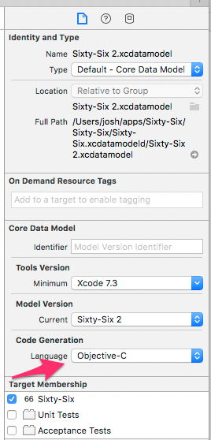

Getting into iOS development, I'm running across all kinds of quirks, workarounds, and best practices. This blog seems like as good a place as any to put them. Here's a big first batch of them.

## Reading `.plist` files

```swift
let path = Bundle.main.bundlePath + "/My.plist"
let pListData = NSDictionary(contentsOfFile:path)
```

## Test Fixture Files

Fixture files are useful whenever you need complex data in a test that can be stored in a file of some kind. First, find the bundle identifier of your test target:

* Select your project in the left-hand sidebar, then select the appropriate test target
* Select the Build Settings tab, then scroll or search to Packaging > Product Bundle Identifier.

Then:

```swift
let testBundle = Bundle(identifier: "your.test.bundle.identifier")!
let path = testBundle.path(forResource: "myfile", ofType: "txt")!
let contentString = try String(contentsOfFile: path)
```

## Generating Swift `NSManagedObject` Subclasses

If Xcode is generating `NSManagedObject` subclasses in Objective-C instead of Swift, select your Core Data Model file, choose the file inspector, and look for a Code Generation > Language setting. Mine keeps getting switched from Swift back to Objective-C, so you may need to check it each time you need to generate an `NSManagedObject` subclass.



## Saving Arrays in Core Data

I wanted to have an array field on a Core Data model. I set it up as a `Transformable` in the Core Data Model file, generated the `NSManagedObject` subclass, then in the subclass I changed the field type to `NSMutableArray`. The problem I ran into was that the saving of the array was super unreliable. I found a good Stack Overflow question about this, and the answer that worked for me was actually [a comment on another answer](http://stackoverflow.com/questions/3057168/core-data-not-saving-changes-to-transformable-property#comment4307153_3059081): changing the field from a `NSMutableArray` to an `NSArray`. When I need to make changes to it, I make a new mutable array with the current array's contents, change it, then make a new immutable array and set that on the Core Data model.

