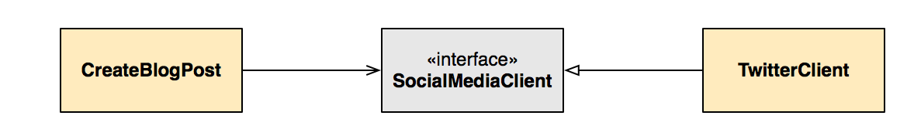
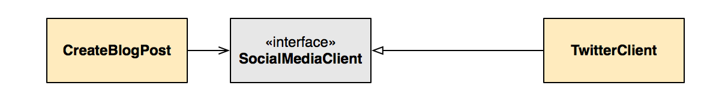
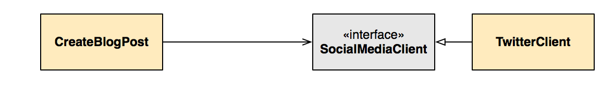
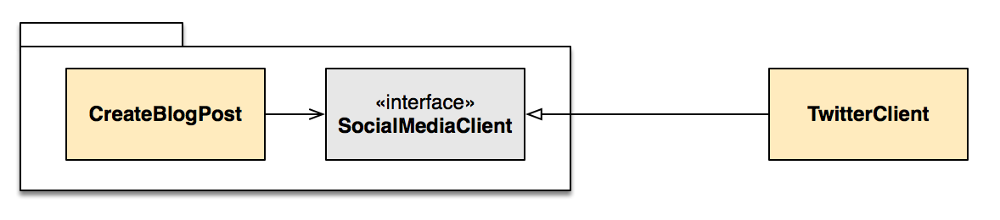
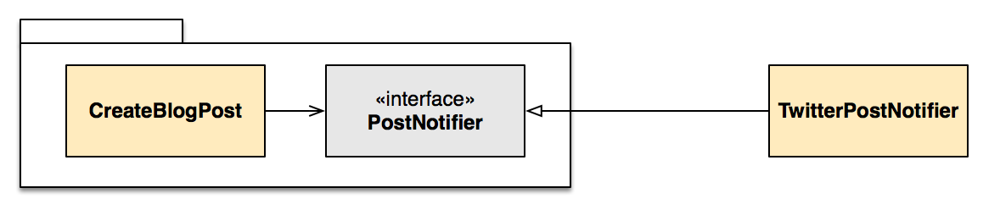

Dependency Inversion might be the most confusing of the [SOLID principles](https://en.wikipedia.org/wiki/SOLID_(object-oriented_design)) of object-oriented design. It's often summarized as "depend on abstractions, not concretions," and that makes sense — but why is it called dependency _inversion_? This isn't just a matter of trivia: understanding the "inversion" in dependency inversion has the potential to transform your abstractions from pointless formalities to powerful design tools.

## A Refresher

First, a brief refresher on dependencies. An object A depends on another object B if a change in B could cause a change in A. There are a few different reasons for dependencies, including:

1. **Association:** if object A has a reference to object B and sends it messages, object A depends on object B. If the method signatures on object B change, A needs to change the messages it sends to B.
2. **Extension:** if object A extends object B, object A depends on object B. In this post, the form of extension we'll discuss is implementing an abstraction. (Depending on your language, abstractions could be called "interfaces," "protocols," or "duck types".) If the method signatures in object B change, the corresponding method signatures on object A need to change as well.

## An Example

Next, let's look at an example of changing a dependency on a concretion into a dependency on an abstraction, and see how that results in inverting the direction of the dependency. Say we have a blog app. We have a `CreateBlogPost` class that wraps up the high-level business logic for the operation. It calls out to lower-level classes to perform different functions, including a `TwitterClient` for sending out a tweet that a new blog post has been made.

To visualize this dependency it's helpful to use a class diagram, where association is represented by an arrow from from the sender to the receiver:


The high-level `CreateBlogPost` class depends on the low-level `TwitterClient` class. Ideally, we'd like to be able to reuse `CreateBlogPost` — for example, posting a notification to Facebook instead. But we can't reuse `CreateBlogPost` if it's coupled to the concrete `TwitterClient`.

## Adding an Abstraction

This is the problem dependency inversion is designed to solve. First, we introduce an abstraction in between the two. Let's call it `SocialMediaClient` for now:



Extension is represented in a class diagram with a hollow arrow from the child to the parent. `SocialMediaClient` is an abstraction, and `TwitterClient` is a concretion that implements that abstraction. Now `CreateBlogPost` isn't associated to a `TwitterClient` per se, but rather to *some kind* of `SocialMediaClient` — and that's all it knows.

You might be wondering about the different directions of the arrows. Are the directions arbitrary? It's easy to invert the dependency if we can just draw the arrows any direction we want! No, the direction of the arrow represents something real about the dependency. Look at the diagram and ask yourself, for each class, if it changed, would the changes propagate to the next object?

If the signature of a method on `SocialMediaClient` abstraction changed, both `CreateBlogPost` and `TwitterClient` would need to change to use the new method signature. Both classes depend on `SocialMediaClient`, so it makes sense the arrows point inward toward it.

How about if `CreateBlogPost` or `TwitterClient` changed — would those changes propagate? No. `SocialMediaClient` is the contract through which they communicate, so as long as that contract stays the same, either `CreateBlogPost` or `TwitterClient` can change all they want. So `SocialMediaClient` doesn't depend on either concrete class, so there aren't arrows pointing out from it.

## Is It Inversion?

We're depending on an abstraction now…but does that involve *inverting* the dependency? Well, it's not clear from the diagram. At first the dependency arrow from `CreateBlogPost` to `TwitterClient` went from left to right. There's still an arrow that direction, but now there's also an arrow from right-to-left: from `TwitterClient` to `SocialMediaClient`.

We can change whether it *looks like* an inversion by changing how we draw the diagram. If we draw the abstraction close to `CreateBlogPost` the longest dependency line points left, so it looks more like an inversion:



But if we draw the abstraction close to `TwitterClient` we're right back where we started: the longest dependency line points right!



Is this a sign that our diagram is totally arbitrary?

No: this is actually a way the diagram helps us think through alternatives in our design. We could think of the abstraction either as more closely associated with `CreateBlogPost` or with `TwitterClient`. In other words, the interface can be *owned by* either the client or the implementor.

If we want to invert the dependency and have our high-level classes independent of our low-level classes, our diagram suggests the *client* should own the abstraction. They should be part of the same "package" (depending on your language, a namespace, module, or group). Drawing the diagram this way makes it clearer that the dependency really has been inverted:



`TwitterClient` depends on the client package that includes `CreateBlogPost` and `SocialMediaClient`. If the client package changes, it forces a change to the implementor. So the dependency is from the low-level implementor to the high-level client. We really have inverted the dependency! And we've accomplished the goal of making the high-level code more reusable.

## Naming

Just *saying* the client owns the abtraction doesn't change anything. But *treating* the abstraction as owned by the client can influence its design. Think about the name the abstraction has right now: `SocialMediaClient`. That name doesn't look right in the same package as `CreateBlogPost`; it's more about the implementation (Twitter) than the role the client is using it for. All `CreateBlogPost` cares about is that it has an object that notifies people that a blog post has been posted. So it's better to name the abstraction something like `PostNotifier`, and the implementation `TwitterPostNotifier`:



This name makes the relationship between the client and interface obvious: as part of `CreateBlogPost`'s responsibilities, it needs a `PostNotifier` to notify someone that a post has been created.

Changing the name of the abstraction, in turn, influences the design of the messages we send it. A `SocialMediaClient` might be designed to receive a message like:

```ruby
social_media_client.add_status(message, username, password)
```

This design restricts `CreateBlogPost` to adding statuses to social media clients that take a message, username, and password. But if it's a `PostNotifier`, we're more likely to design a message like:

```ruby
post_notifier.created(blog_post)
```

This interface captures the role the notifier plays for the `CreateBlogPost` client: it's provided with a blog post that was created, and it takes care of any details about how to send a notification: what account to post it to, what the status message should say, etc. This message design makes the high-level `CreateBlogPost` class even more independent of its low-level collaborators.

## Conclusion

Class diagrams have helped us see that depending on abstractions doesn't automatically invert the direction of dependencies. Whether they're inverted depends on whether you decide that the client owns the abstraction. That decision influences the design of the abstraction, freeing up your high-level classes from low-level details.

Take a look at the abstractions in your code and see if you can refactor them to focus more on the role they play in the client. And maybe even try drawing a class diagram to see if it helps!

If you'd like to know more, check out the original book on the SOLID principles, [*Agile Software Development: Principles, Patterns, and Practices*](Agile Software Development, Principles, Patterns, and Practices). Some of its details are dated, but it provides insights on problems we still struggle with today.