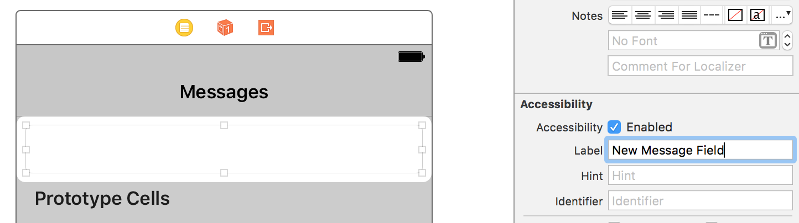
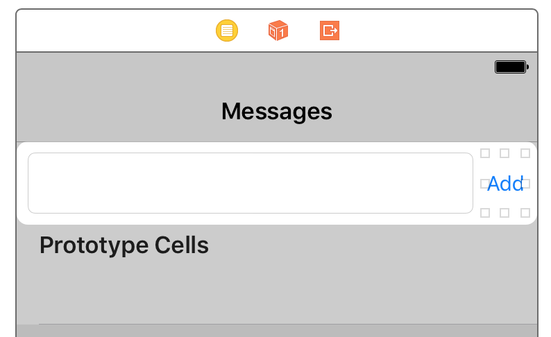

### Specify adding a message [<span class="octicon octicon-mark-github"></span>](https://github.com/learn-tdd-in/cocoa-touch/commit/7b9fbe96e6275495271cb3bfdd71728e18a2ad66)

#### Acceptance Tests/CreatingAMessageTest.m

```diff
+#import <KIF/KIF.h>
+
+@interface CreatingAMessageTests : KIFTestCase
+
+@end
+
+@implementation CreatingAMessageTests
+
+- (void)testItCanCreateAMessage
+{
+    NSString *testMessage = @"Hello, test!";
+
+    [tester enterText:testMessage intoViewWithAccessibilityLabel:@"New Message Field"];
+    [tester tapViewWithAccessibilityLabel:@"Add"];
+
+    UITableViewCell *postCell = [tester waitForCellAtIndexPath:[NSIndexPath indexPathForRow:0 inSection:0]
+                        inTableViewWithAccessibilityIdentifier:@"Messages Table"];
+
+    XCTAssertTrue([postCell.textLabel.text isEqualToString:testMessage],
+                  @"Expected cell label to be '%@', was '%@'", testMessage, postCell.textLabel.text);
+}
+
+@end
```

To start out, we write an acceptance test for the entire feature we want to build. This test specifies that the user will enter a message into a field, tap an Add button, and then see that message in the first cell of a table.

The first error we get is that there is no message field:

Red: Failed to find accessibility element with the label "New Message Field"


### Add new message field [<span class="octicon octicon-mark-github"></span>](https://github.com/learn-tdd-in/cocoa-touch/commit/38aee4c205f969347a379556726f4fb593ff2e9e)




As part of adding the message field, we go ahead and set up the table view controller we'll be using. We set the accessibility label on the field to "New Message Field" so the acceptance test can find it.

The next error we get is similar: now we can't find the Add button:

Red: Failed to find accessibility element with the label "Add"


### Place Add button [<span class="octicon octicon-mark-github"></span>](https://github.com/learn-tdd-in/cocoa-touch/commit/247ebc40b475fe2d826a949d75bdbcafcd52592b)




We put an Add button into the view so the test can find it.

Next, the test can't find the table to look in:

Red: Could not find element with accessibilityIdentifier == "Messages Table"


### Set table accessibility identifier [<span class="octicon octicon-mark-github"></span>](https://github.com/learn-tdd-in/cocoa-touch/commit/74c7b7ae9838685cd92bec5f8f6ee64e648d4e97)

#### Learn TDD in Cocoa Touch/MessagesViewController.swift

```diff
+import UIKit
+
+class MessagesViewController: UITableViewController {
+    
+    override func viewDidLoad() {
+        tableView.accessibilityIdentifier = "Messages Table"
+    }
+
+}
```

Interface Builder doesn't provide a way to set the accessibility identifier on the table, so we need to set it in our code instead. We create a MessagesViewController class that subclasses UITableViewController, then we set the table's accessibility identifier in the `viewDidLoad` method.

Next, the acceptance test can find the table, but it expects there to be a row added to the table, and there isn't one:

Red: Row 0 is not found in section 0 of table view


### Display contents of message store in table view [<span class="octicon octicon-mark-github"></span>](https://github.com/learn-tdd-in/cocoa-touch/commit/87ca07f6126afa6fd6a9d5cdbdd6fd6463c2a1bc)

#### Learn TDD in Cocoa Touch/MessagesViewController.swift

```diff
 
 class MessagesViewController: UITableViewController {
     
+    var store: MessageStore!
+    
     override func viewDidLoad() {
         tableView.accessibilityIdentifier = "Messages Table"
+        store = MessageStore()
+    }
+    
+    override func tableView(_ tableView: UITableView, numberOfRowsInSection section: Int) -> Int {
+        return store.count
     }
 
+    @IBAction func addMessage(sender: AnyObject) {
+        store.create()
+        tableView.reloadData()
+    }
+    
 }
```

We create a `MessageStore` to hold the messages that we want to display in the table. We set the Add button to call a `create()` method on the MessageStore, and we set the table to check the `MessageStore`'s `count` property when determining the number of rows to display. Because the acceptance error we're trying to correct is the missing row, that's all the `MessageStore` functionality that we need at this point.

Red: Use of undeclared identifier ‘MessageStore’

We get an error that the `MessageStore` we've referred to doesn't exist.


### Add message store class [<span class="octicon octicon-mark-github"></span>](https://github.com/learn-tdd-in/cocoa-touch/commit/9d825e04401ddc6becfa0f6567a5a40fae462523)

#### Learn TDD in Cocoa Touch/MessageStore.swift

```diff
+class MessageStore {
+
+}
```

To make sure we don't implement more than the tests are driving us to, we do the minimum necessary to get past the current "undeclared identifier": we declare a `MessageStore` class. After this, we get several errors preventing the code from compiling. Let's take them one at a time:

First Red: Value of type ‘MessageStore’ has no member ‘count’


### Add count property [<span class="octicon octicon-mark-github"></span>](https://github.com/learn-tdd-in/cocoa-touch/commit/95c6469eb7363741443c7c1c42f24f94cd0c09c0)

#### Learn TDD in Cocoa Touch/MessageStore.swift

```diff
 class MessageStore {
 
+    var count: Int {
+        get {
+            return 0
+        }
+    }
+    
 }
```

We declare a `count` property to fix the error that one is missing. Because we know its value will ultimately be dynamically determined from the number of posts in the store, we make it a calculated property. But for now, we just return a hard-coded zero value to get the code to compile.

First Red: Value of type `MessageStore` has no member `create`

With that, the compiler is satisfied with our `count` property, and the next error is that `MessageStore` also needs a `create()` method.


### Add create function [<span class="octicon octicon-mark-github"></span>](https://github.com/learn-tdd-in/cocoa-touch/commit/3d7bdafd787b564fe94e2e364d22077189e77297)

#### Learn TDD in Cocoa Touch/MessageStore.swift

```diff
             return 0
         }
     }
+
+    func create() {
+        
+    }
     
 }
```

We add a `create()` function that the compiler is asking for. With this, the compiler is happy with our `create()` function, because it doesn't take any parameters or return a value.

With this, we're past the compilation errors, and back to a failing acceptance test assertion:

Red: Row 0 is not found in section 0 of table view

This is the same failed assertion we saw before. We've made the number of rows in the table driven off of the `MessageStore`, but because the `MessageStore` always returns a count of 0, the row we need never appears. We need the `MessageStore`'s `count` to return 1 after `create()` is called.


### Specify count should be 1 after creating [<span class="octicon octicon-mark-github"></span>](https://github.com/learn-tdd-in/cocoa-touch/commit/a1307eb02cfc4ae34496370a60f892efbf32f113)

#### Unit Tests/MessageStoreTests.swift

```diff
+import XCTest
+@testable import Learn_TDD_in_Cocoa_Touch
+
+class MessageStoreTests: XCTestCase {
+    
+    var store: MessageStore!
+    
+    override func setUp() {
+        super.setUp()
+        store = MessageStore()
+    }
+    
+    override func tearDown() {
+        super.tearDown()
+    }
+    
+    func testItReturnsACountOfOneAfterCreating() {
+        store.create()
+        
+        let count = store.count
+        
+        XCTAssertEqual(count, 1, "Expected store.count() to be 1 but was \(count)")
+    }
+}
```

This is a behavioral need, so instead of implementing the code to fix this directly, we step down from the acceptance test level and write a unit test for the `PostStore`. Our goal is to reproduce the acceptance test failure at the unit level, so that we know exactly what this unit needs to do to accomplish our overall goal.

Red: Expected store.count() to be 1 but was 0

This failed assertion is exactly the same problem we see at the acceptance level, so now we're ready to implement this behavior.


### Increase message count when `create()` is called [<span class="octicon octicon-mark-github"></span>](https://github.com/learn-tdd-in/cocoa-touch/commit/4a129a8f4358a83e5b11c4f4a48bf04469049579)

#### Learn TDD in Cocoa Touch/Message.swift

```diff
+class Message {
+    
+}
```


#### Learn TDD in Cocoa Touch/MessageStore.swift

```diff
 class MessageStore {
 
+    private var messages = [Message]()
+
     var count: Int {
         get {
-            return 0
+            return messages.count
         }
     }
 
     func create() {
-        
+        let message = Message()
+        messages.append(message)
     }
     
 }
```

To get the message count to increase when `create()` is called, we _could_ just add an Int property and increment it. However, taking such a small step doesn't add a lot of value. It's often more useful to "write the code we wish we had." In this case, we know the `MessageStore` is going to have a list of `Message` objects, so it seems safe to go ahead and have the `MessageStore` keep an array of `Message`s, add a new `Message` every time `create()` is called, and delegate the `MessageStore`'s `count` property to the array's `count`. The compiler requires us to go ahead and create a `Message` class, but we don't add anything else to it at this point: we wait until the tests drive us to add data and functionality to it.

This gets our unit test passing, and moves our acceptance test past its current error to a new one.

Inner green
Outer red: UITableView…failed to obtain a cell from its dataSource

The table view is trying to create a cell, which means we succeeded in increasing the row count when the user clicks "Add." But now the table view needs to know how to create a cell.


### Set up cell for table view [<span class="octicon octicon-mark-github"></span>](https://github.com/learn-tdd-in/cocoa-touch/commit/716ccffa0838b7d075e68f3a259f67e1613c3f8d)

#### Learn TDD in Cocoa Touch/MessagesViewController.swift

```diff
 import UIKit
 
 class MessagesViewController: UITableViewController {
-    
+
     var store: MessageStore!
-    
+
     override func viewDidLoad() {
         tableView.accessibilityIdentifier = "Messages Table"
         store = MessageStore()
     }
-    
+
     override func tableView(_ tableView: UITableView, numberOfRowsInSection section: Int) -> Int {
         return store.count
     }
 
+    override func tableView(_ tableView: UITableView, cellForRowAt indexPath: IndexPath) -> UITableViewCell {
+        let cell = tableView.dequeueReusableCell(withIdentifier: "Cell", for: indexPath)
+        return cell
+    }
+
     @IBAction func addMessage(sender: AnyObject) {
         store.create()
         tableView.reloadData()
     }
-    
+
 }
```

We do the minimum necessary to get past the current acceptance test error: we implement `tableView(_:cellForRowAtIndexPath:)` to dequeue a cell with the identifier "Cell" (we only need one kind of cell), and we mark the prototype cell in our storyboard with that identifier.

Red: Expected cell label to be 'Hello, test!', was '(null)'

Now the cell is retrieved, but our assertion about the content of the cell's label is failing. Because we didn't customize the cell at all, it doesn't have a label by default.


### Pass message text along into post [<span class="octicon octicon-mark-github"></span>](https://github.com/learn-tdd-in/cocoa-touch/commit/9e3880c110eef43a76466e6ca4db07151ce8f3c9)

#### Learn TDD in Cocoa Touch/MessagesViewController.swift

```diff
 
     var store: MessageStore!
 
+    @IBOutlet var messageField: UITextField!
+
     override func viewDidLoad() {
         tableView.accessibilityIdentifier = "Messages Table"
         store = MessageStore()
...
 
     override func tableView(_ tableView: UITableView, cellForRowAt indexPath: IndexPath) -> UITableViewCell {
         let cell = tableView.dequeueReusableCell(withIdentifier: "Cell", for: indexPath)
+        let message = store.find(indexPath.row)
+
+        cell.textLabel?.text = message.text
+
         return cell
     }
 
     @IBAction func addMessage(sender: AnyObject) {
-        store.create()
-        tableView.reloadData()
+        if let message = messageField.text {
+            store.create(["text": message])
+            tableView.reloadData()
+        }
     }
 
 }
```

To get the right text to show up in the cell, when a message is saved we need to retrieve the text from the text field, and pass it into the `MessageStore`'s `create()` method. Then, when we're displaying the cell, we need to retrieve a `Message` from the `MessageStore` and use its `text` value for the cell's label.

To accomplish this, we add a dictionary parameter to `create()`, and we add a `find()` method to retrieve a `Message`.

First Red: Value of type `MessageStore` has no member `find`

The first compilation error we get is that there is no `find()` method on `MessageStore`.


### Add find method [<span class="octicon octicon-mark-github"></span>](https://github.com/learn-tdd-in/cocoa-touch/commit/3e8d85bc5b4cd80b690a5d5c4ac3cb0817f624c6)

#### Learn TDD in Cocoa Touch/MessageStore.swift

```diff
         messages.append(message)
     }
     
+    func find(_ index: Int) -> Message {
+        return Message()
+    }
+    
 }
```

Rather than dropping down to the unit level yet, we fix the compilation error right away, because until our code compiles we can't get any other feedback from tests. We simply add a `find()` method that takes an `Int` parameter and returns a `Message`. To do the minimum necessary to satisfy the compiler, we just instantiate and return a new empty `Message`.

Red: Value of type `Message` has no member `message`

Now our `Message` is being returned to the view controller, but when it tries to access the `message` property, there isn't one.


### Add text field to message [<span class="octicon octicon-mark-github"></span>](https://github.com/learn-tdd-in/cocoa-touch/commit/8d3835b1196c89de5a93cd9808b92a3d6c3aa920)

#### Learn TDD in Cocoa Touch/Message.swift

```diff
 class Message {
     
+    var text: String?
+    
 }
```

We add a simple `text` property to `Message` that will store our message string. This gets us to our next unrelated compilation error:

Red: Argument passed to a call that takes no arguments

Previously `create()` didn't have any arguments because all it needed to do was result in an incremented `count`. Now that our view controller is passing a dictionary into it with the message string, we need to update our other code to match.


### Add message data param [<span class="octicon octicon-mark-github"></span>](https://github.com/learn-tdd-in/cocoa-touch/commit/d06895bd47ed660a5453e2407b9ba845bbd2a199)

#### Learn TDD in Cocoa Touch/MessageStore.swift

```diff
         }
     }
 
-    func create() {
+    func create(_ messageData: [String:String]) {
         let message = Message()
         messages.append(message)
     }
```


#### Unit Tests/MessageStoreTests.swift

```diff
     }
     
     func testItReturnsACountOfOneAfterCreating() {
-        store.create()
+        store.create([:])
         
         let count = store.count
         
```

We add a dictionary argument to the `create()` method, as well as updating all references to it (in this case, just one in the `MessageStoreTests`). This gets us past our last compilation error, and now we get an acceptance test failure:

Red: Expected cell label to be 'Hello, test!', was '(null)'

Like last time, this is the same acceptance test failure we were getting previously. We've added the parameters and properties to pass the message along from the text field into the cell label, but we haven't actually persisted it: in our `find()` method, we just return an empty `Message`.


### Specify store should retrieve posts [<span class="octicon octicon-mark-github"></span>](https://github.com/learn-tdd-in/cocoa-touch/commit/aa9f3474718fa509b82444ec03a2df3e760b9abe)

#### Unit Tests/MessageStoreTests.swift

```diff
         
         XCTAssertEqual(count, 1, "Expected store.count() to be 1 but was \(count)")
     }
+    
+    func testItAllowsRetrievingAPostByRow() {
+        let testText = "test text"
+        store.create(["text": testText])
+        
+        let message = store.find(0)
+        XCTAssertEqual(message.text, testText)
+    }
 }
```

We add a `MessageStore` unit test showing the behavior we need: when `create()` is called with a certain message key, the post we later `find()` should have that same message.

Red: (“nil”) is not equal to (“Optional(“test message”)”)

With this unit test failure, we've reproduced the problem we're seeing at the acceptance test level.


### Save and retrieve message with data [<span class="octicon octicon-mark-github"></span>](https://github.com/learn-tdd-in/cocoa-touch/commit/a032c589e6f6e1dbeb3eee78b456639fe8d07a1c)

#### Learn TDD in Cocoa Touch/MessageStore.swift

```diff
 
     func create(_ messageData: [String:String]) {
         let message = Message()
+        message.text = messageData["text"]
         messages.append(message)
     }
     
     func find(_ index: Int) -> Message {
-        return Message()
+        return messages[index]
     }
     
 }
```

We check for the "text" key in the dictionary passed into `create()` and save it on the `Message` that's created. Now we actually need to retrieve that same `Message` in the `find()` method, and we do so. This causes the unit test to pass, and our acceptance test is passing as well!

Inner green
Outer green

We've successfully used Test-Driven Development to drive out our feature.

