## 200 OK

## 201 Created

## 202 Accepted

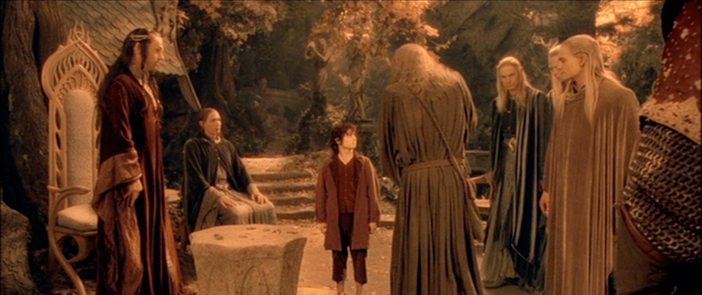

## 203 Non-Authoritative Information

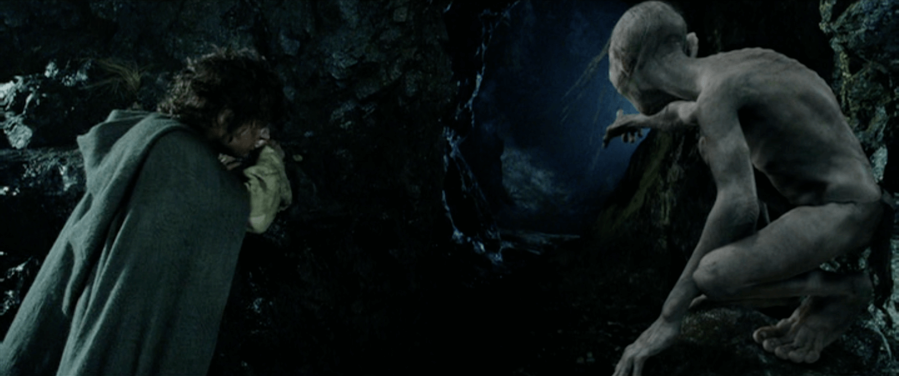

## 204 No Content

## 300 Multiple Choices

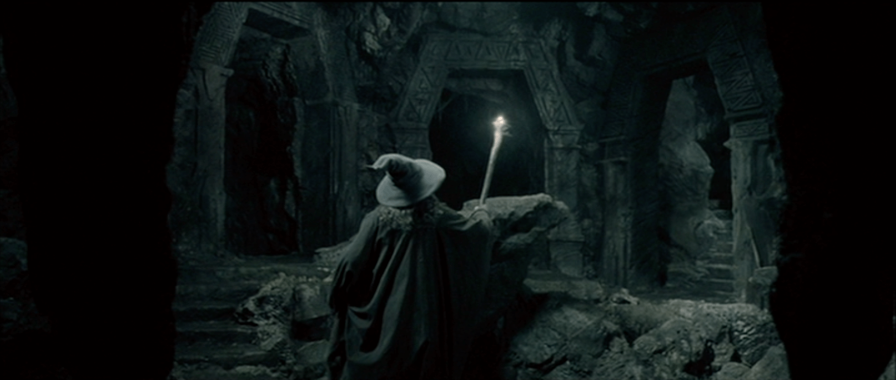

## 301 Moved Permanently

## 302 Found

## 304 Not Modified

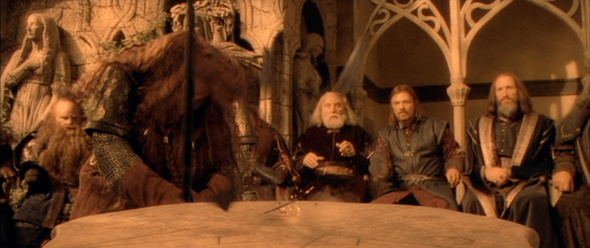

## 305 Use Proxy

## 400 Bad Request

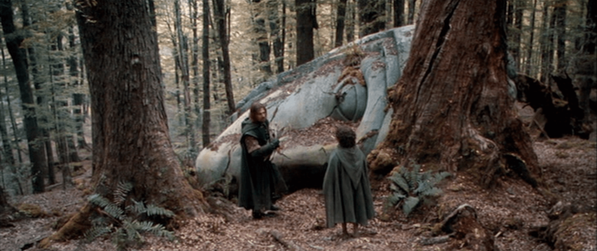

## 401 Unauthorized

## 404 Not Found

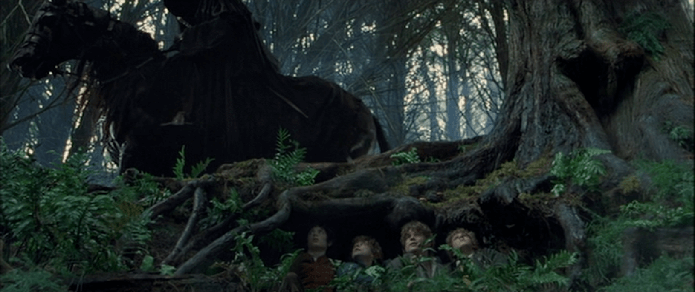

## 406 Not Acceptable

## 409 Conflict

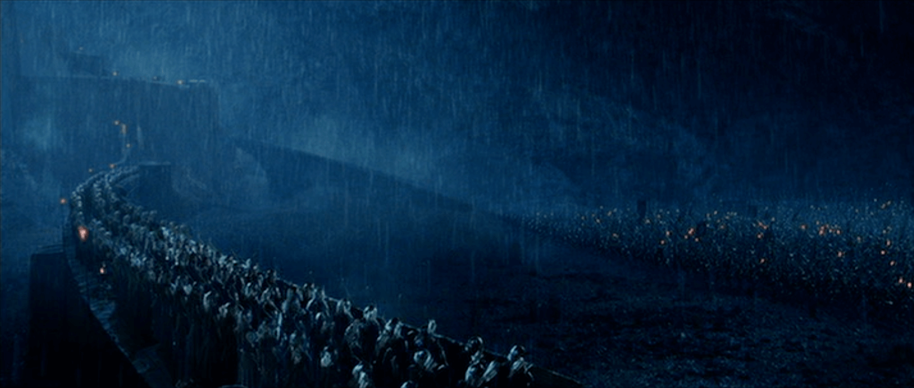

## 411 Length Required

## 423 Locked

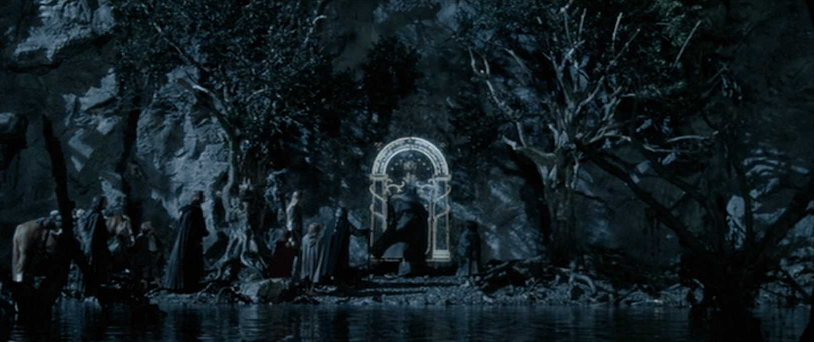

## 424 Failed Dependency

## 426 Upgrade Required

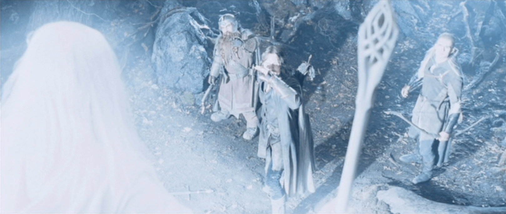

## 500 Internal Server Error

## 501 Not Implemented

## 502 Bad Gateway

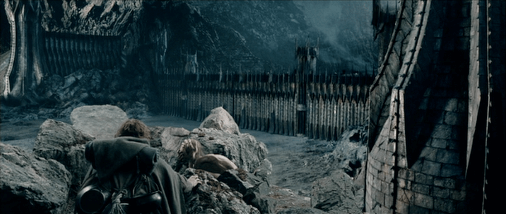

## 506 Variant Also Negotiates

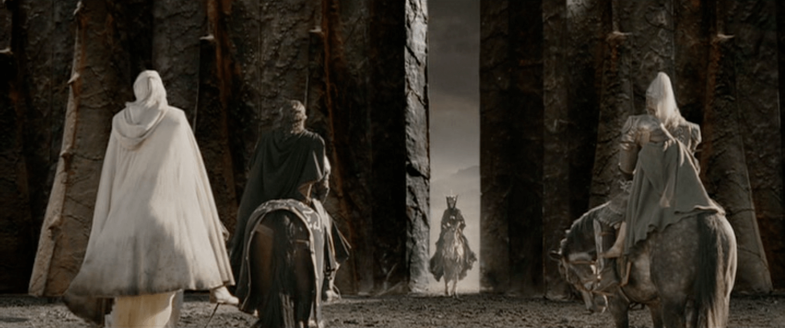

## 508 Loop Detected

## 511 Network Authentication Required

